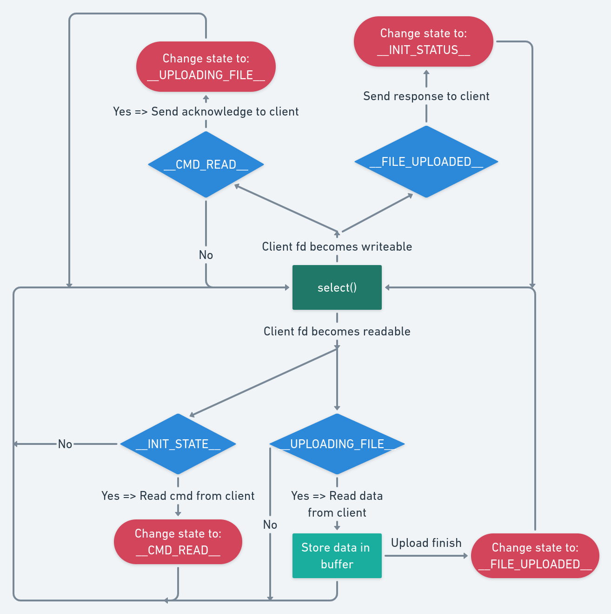
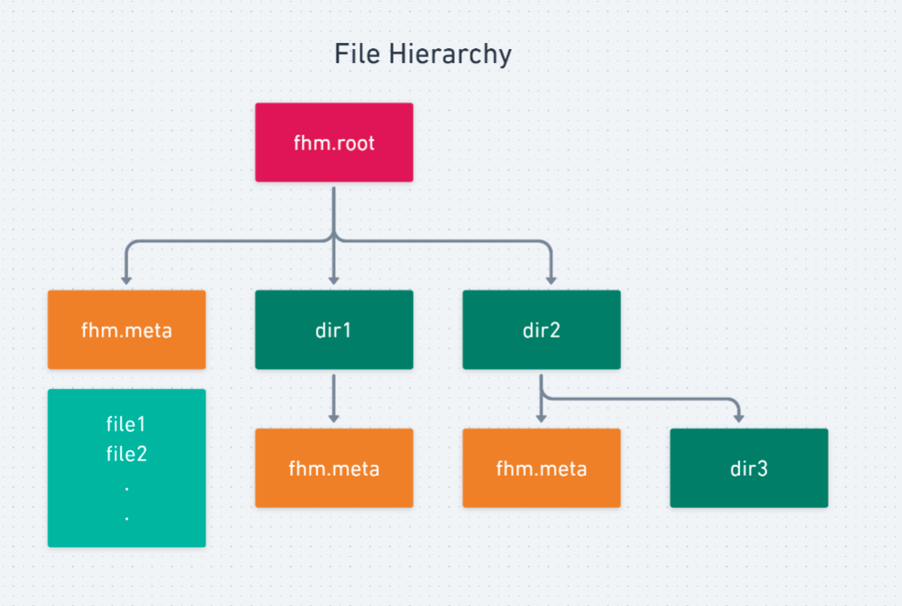

# Assignment 2 - P1

Submitted to: Dr. Hari Babu\
Course: Network Programming IS F462\
Submitted by: **Kunal Mohta (2017A7PS0148P)** & **Laksh Singla (2017A7PS0082P)**

## Design
As the problem statement says that all servers have to follow I/O Multiplexing model with non-blocking read/write, it required to maintain a state for each client to remember what and how much task has been done.

To illustrate this approach, refer the figure below. It shows the states and transitions required when a file is being uploaded from client to the Name server.

<center>

</center>

All other commands have a state diagram on similar lines.

The data is stored only in the Data Server, and the file hierarchy is maintained by the Name Server.

### File Hierarchy

File hierarchy is stored and maintained by the Name server. The following figure depicts our approach of maintaining the hierarchy.

<center>

</center>

All hierarchy-related information lies inside the `fhm.root` directory. To depict a directory in the hierarchy, an actual directory is created. List of all files in a directory is stored in a `fhm.meta` file inside that directory. Therefore, every directory should have a `fhm.meta` file and may have more directories, which in turn will all have `fhm.meta` file, and so on.

## Usage

### Running Name server
```
make ns
./ns.out
```

### Running Data server
```
make ds
./ds.out <port>
```

### Running client
```
make client
./c.out
```

Client supports the following commands:-
```
upload <filename>
ls
cp <src file/dir (relative)> <dest file/dir (relative)>
cd <dir>
mv <src file/dir (relative)> <dest file/dir (relative)>
mkdir <dir name>
rm <file/dir>
cat <file>
```


## Assumptions/Limitations

- cd
	- No absolute paths
	- No ../asdf/asdf
	- `cd asdf` means cd into folder `asdf` in cwd
	- `cd ..` allowed
