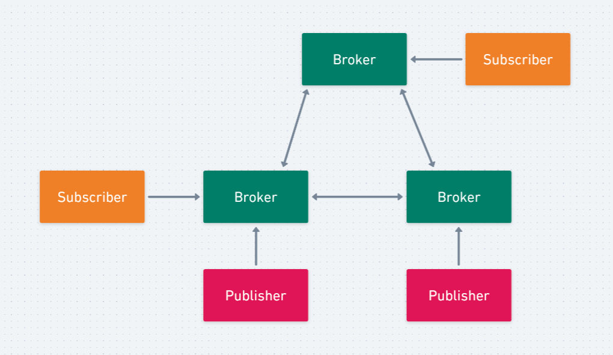
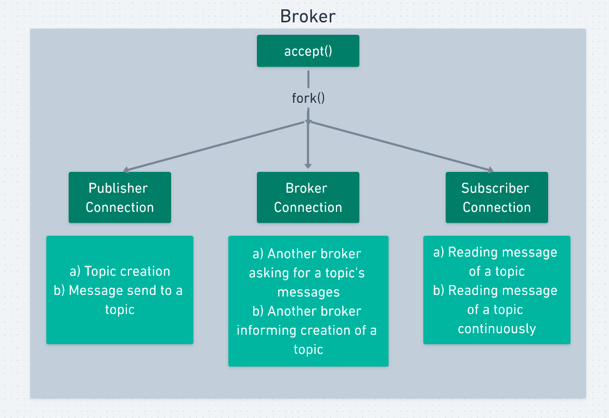
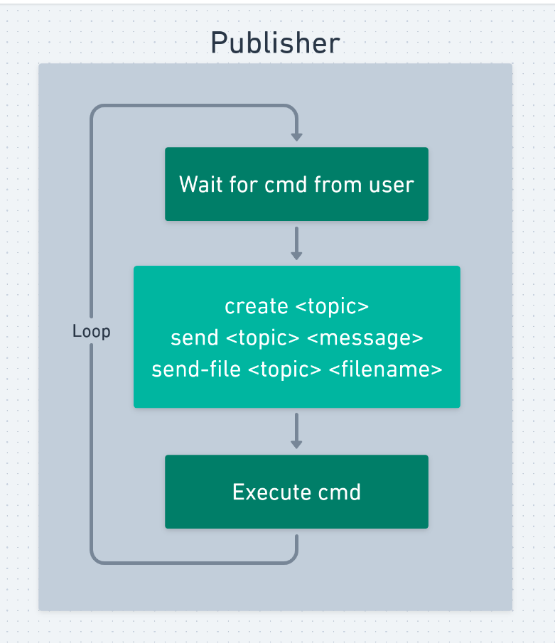
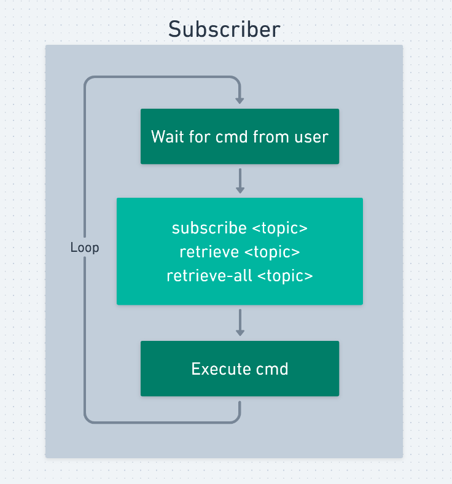
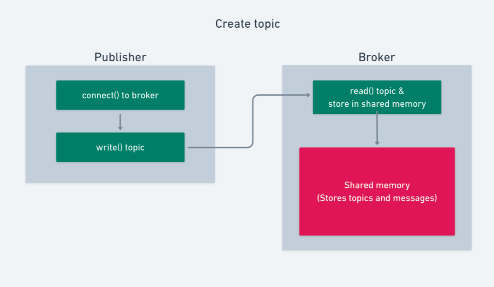
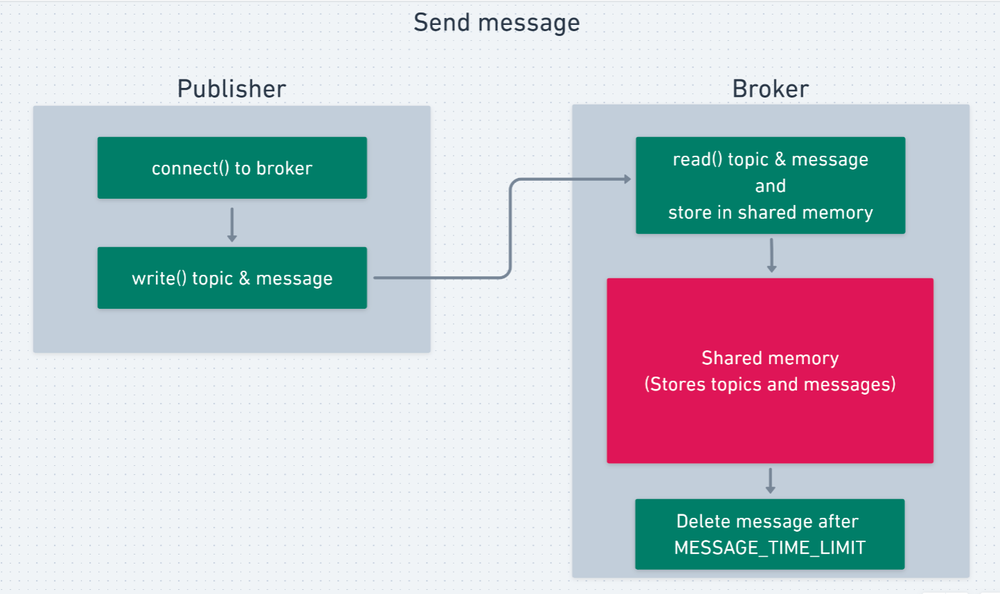
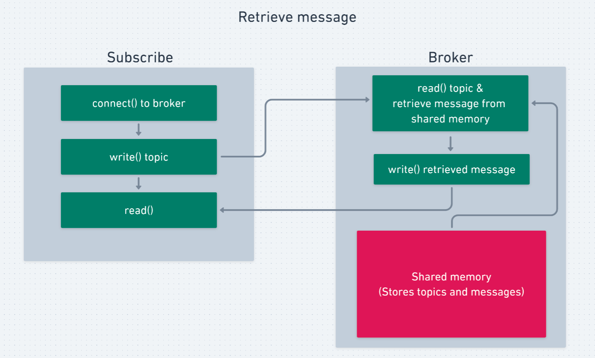

# Assignment 2 - P2

Submitted to: Dr. Hari Babu\
Course: Network Programming IS F462\
Submitted by: **Kunal Mohta (2017A7PS0148P)** & **Laksh Singla (2017A7PS0082P)**

## Design

Following figures illustrate the design we incorporated.\
Publishers and Subscribers act like clients, with Brokers as central server in between them.The Brokers are connected to each other in a circular topology. Each publisher and subscriber is connected to exactly one of the Brokers in the topology.

<br>
Fig.1 shows the broad architecture in which the the Brokers, Publishers & Subscribers may be connected.
<center>
<h3>Fig. 1</h3>


<br>
<center>
<h3>Fig. 2 Broker</h3>


<br>
<center>
<h3>Fig. 3 Publisher</h3>


<br>
<center>
<h3>Fig. 4 Subscriber</h3>


<br>
<center>
<h3>Fig. 5 Topic creation</h3>


When a broker receives the request to issue a new topic, it informs its **left** neighbouring broker in the circular topology about the event, which then itself creates the same topic and passes on the information to its own **left** neighbouring. This is carried out continuously till all the brokers become aware of the creation of a new topic.

<br>
<center>
<h3>Fig. 6 Send message</h3>


<br>
<center>
<h3>Fig. 7 Retrieve message</h3>


### Broker communication via circular topology
When a subscriber requests to its corresponding broker for messages of a topic and the broker finds out that it has no messages for that topic, then the broker issues a *query* for messages of that topic to its **left** neighbour. If the neighbour also does not have messages on the topic, it queries its **left** neighbour, and so on, till we find a broker which has messages on that topic. It then sends these messages along the same path that it received the request. If no brokers have message on the topic, the subscriber is accordingly informed.

## Usage

### Running Broker

```
make broker
./b.out <broker-index>
```
`<broker-index>` depends on defined array of IPs and Ports of all brokers in `broker.c`.\
By default we have created the array for 3 brokers-
```
0 => {IP = "127.0.0.1", Port = 4000}
1 => {IP = "127.0.0.1", Port = 5000}
2 => {IP = "127.0.0.1", Port = 6000}
```
Eg. to run 0th broker
```
./b.out 0
```

### Running Publisher

```
make pub
./pub.out <broker-ip> <broker-port>
```
where `<broker-ip>` and `<broker-port>` refer to the IP and Port, respectively, of the broker to which Publisher wants to connect to.

Publisher program offers 3 commands:-
```
create <topic-name>
// Create a new topic

send <topic-name> <message>
// Send a message to topic

send-file <topic-name> <filename>
// Send a file as series of messages to topic
```

### Running Subscriber

```
make sub
./sub.out <broker-ip> <broker-port>
```
where `<broker-ip>` and `<broker-port>` refer to the IP and Port, respectively, of the broker to which Subscriber wants to connect to.

Subscriber program offers 3 commands:-
```
subscribe <topic-name>
// Subscribe to a topic

retrieve <topic-name>
// Retrieve a message from topic

retrieve-all <topic-name>
// Continuously retrieve messages from topic
```

## Assumptions/Limitations

- The set of Brokers is fixed and known before hand. The IPs and Port numbers of all the brokers have to placed in *broker.c*
- All brokers need to be running before publishers and subscribers start performing actions.

## Alternative approach to gaurantee FIFO order

The approach described in the problem statement, and the one implemented, does not gaurantee the First In First Out order of messages.

In order to maintain FIFO, a timestamp is required to be maintained for each incoming message. Every query for retrieval of message from a topic by a subscriber would require querying to all the brokers in the network and comparing the timestamp of latest message of the topic on each broker, and choosing the latest among them for sending.