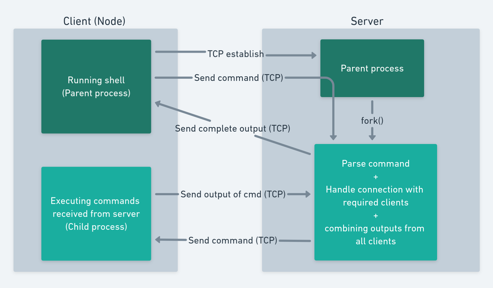
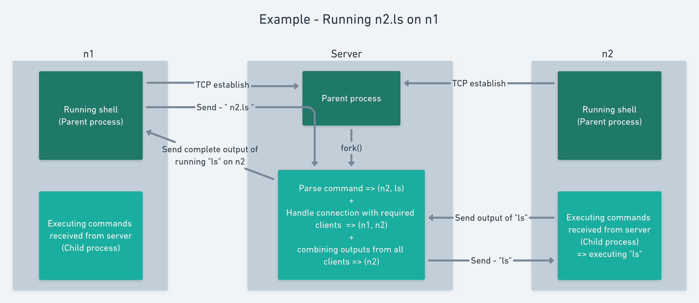

# Cluster Shell

Submitted to: Dr. Hari Babu\
Course: Network Programming IS F462\
Assignment 1

## Design
This project aims to extend the shell features to a cluster of machines. There is a central machine (server) that coordinates all the interactions between different nodes (clients).

The following figure gives an illustration of the design we incorporated.

As soon as a node (client) starts the shell on their machine, a TCP connection is requested and established with the server (which creates a new child process to handle the connection), and the shell is then ready to accept commands from the user. There is also a child process created on the client, which waits for an other connection to be established with the server. This child process is responsible for executing the commands that are received from the server and are required to be executed on the given machine.\
When the user enters the command on the shell, it is sent to the server. On the server, the command is first parsed to break it into sequence of (command, node number) pairs, so that the server knows which command is to be executed on which node. The output from all the nodes is collected by the server and the result is sent to the command executing node.

The following figure shows how an example command would run on this architecture.

### Lifecycle of a command execution

- **When server starts** -
It creates a socket and starts listening for connections from clients. It works like a concurrent server, where a new process is spawned to handle each new connection. When a connection is established with a client, server waits to read a message from the client.

- **When client starts** -
It tries to establish connection with the server (i.e. server should be running before trying to run the client). After the connection is established, it starts running a shell to accept commands from the user. The client also spawns a child process in the beginning, which creates a socket and starts listening for connection from the server. This process would be responsible for executing commands whose output is required by other nodes (clients).

- **When user enters a command on the client shell** -
The command is sent to the server via the already established connection. The shell then waits to read the output from server on this connection.

- **When server receives command from the client** -
First it parses the command to break it at pipes (`|`) creating smaller sub-commands and to determine which sub-command is to be sent to which client for execution (via name-IP pairs specified in CONFIG file). After parsing, the sub-commands are sent to the respective IP addresses, via a connection where the client acts as the passive end.

- **When client receives command from the server** -
Client runs the received sub-command using `popen()`. The output is first written into a pipe, which is then read and sent back to the server.

- **After server receives outputs from all the clients** -
It combines them as required and sends them to the original client that ran the main command.

- **After client receives output from the server** -
The output is displayed for the user to see and the shell is ready to accept another command.

## Usage

## Screenshots
